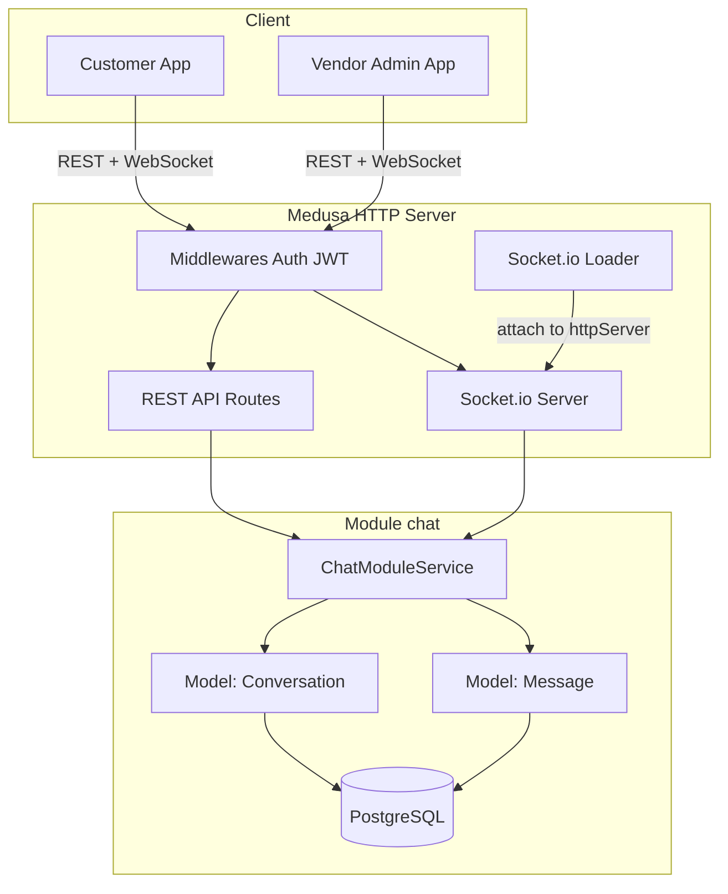
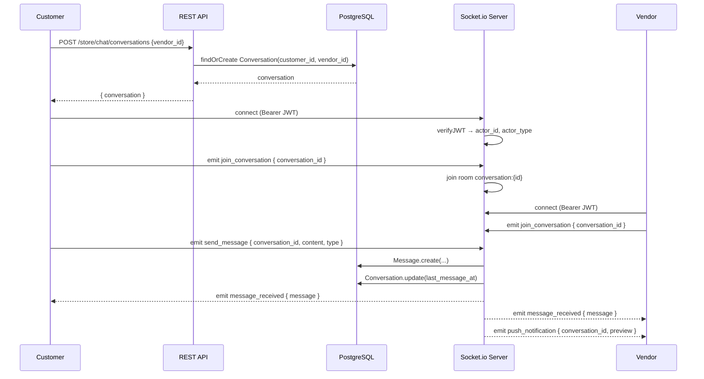
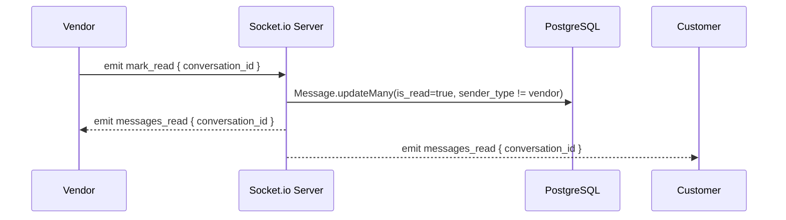
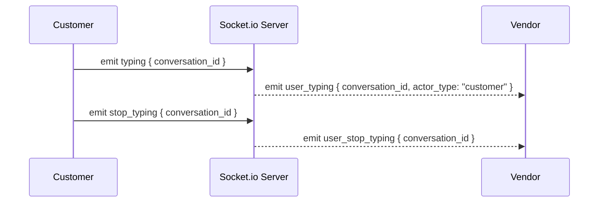

# Design Document: Realtime Chat (Style Alibaba)

## Overview

Système de messagerie temps réel 1-to-1 entre `customer` (acheteur) et `vendor` (vendeur), intégré nativement dans Medusa v2 via un module custom `chat`. L'architecture repose sur un module MikroORM pour la persistance, un loader Medusa pour initialiser Socket.io sur le serveur HTTP existant, et des routes REST pour l'historique. Le design s'inspire du chat professionnel Alibaba Trade : conversations persistantes, statut lu/non lu, envoi de fichiers, indicateur de frappe, et notifications push via événements Socket.io.

Le module `chat` est entièrement découplé du module `marketplace` — il référence `customer_id` et `vendor_id` comme clés étrangères logiques (pas de foreign key cross-module), conformément aux conventions Medusa v2.

## Architecture



## Diagrammes de séquence

### Flux : Démarrer une conversation et envoyer un message



### Flux : Marquer comme lu



### Flux : Indicateur de frappe



## Composants et Interfaces

### Module `chat` — ChatModuleService

**Purpose**: Couche de persistance et logique métier du chat. Étend `MedusaService` pour bénéficier du CRUD automatique.

**Interface**:
```typescript
interface IChatModuleService {
  findOrCreateConversation(customerId: string, vendorId: string): Promise<Conversation>
  listConversations(filters: { customer_id?: string; vendor_id?: string }): Promise<Conversation[]>
  retrieveConversation(id: string): Promise<Conversation>
  createMessage(data: CreateMessageDTO): Promise<Message>
  listMessages(conversationId: string, options?: { limit?: number; offset?: number }): Promise<Message[]>
  markMessagesAsRead(conversationId: string, readerType: "customer" | "vendor"): Promise<void>
}

interface CreateMessageDTO {
  conversation_id: string
  sender_type: "customer" | "vendor"
  sender_id: string
  content: string
  type: "text" | "image" | "file"
  file_url?: string
}
```

**Responsabilités**:
- CRUD Conversation et Message via MikroORM
- `findOrCreateConversation` : idempotent, évite les doublons
- `markMessagesAsRead` : met à jour tous les messages non lus envoyés par l'autre partie

---

### Loader Socket.io — `src/loaders/socket.ts`

**Purpose**: Initialise le serveur Socket.io en s'attachant au serveur HTTP Medusa au démarrage. Gère l'authentification JWT et le routage des événements.

**Interface**:
```typescript
// Loader Medusa — appelé automatiquement au démarrage
export default async function socketLoader({ app, container }: LoaderOptions): Promise<void>

// Événements entrants (client → serveur)
type ClientToServerEvents = {
  join_conversation: (data: { conversation_id: string }) => void
  send_message: (data: SendMessagePayload) => void
  mark_read: (data: { conversation_id: string }) => void
  typing: (data: { conversation_id: string }) => void
  stop_typing: (data: { conversation_id: string }) => void
}

// Événements sortants (serveur → client)
type ServerToClientEvents = {
  message_received: (message: MessageDTO) => void
  messages_read: (data: { conversation_id: string }) => void
  user_typing: (data: { conversation_id: string; actor_type: string }) => void
  user_stop_typing: (data: { conversation_id: string }) => void
  push_notification: (data: PushNotificationDTO) => void
  error: (data: { message: string }) => void
}
```

**Responsabilités**:
- S'attacher au `httpServer` Medusa via `new Server(httpServer, { cors: ... })`
- Vérifier le JWT Bearer dans `socket.handshake.auth.token`
- Résoudre `ChatModuleService` depuis le container IoC Medusa
- Gérer les rooms Socket.io : `conversation:{id}`
- Broadcaster les événements aux membres de la room

---

### REST API — Routes Store (Customer)

```typescript
// GET /store/chat/conversations
// Response: { conversations: ConversationDTO[] }

// POST /store/chat/conversations
// Body: { vendor_id: string }
// Response: { conversation: ConversationDTO }

// GET /store/chat/conversations/:id/messages
// Query: { limit?: number; offset?: number }
// Response: { messages: MessageDTO[]; count: number }
```

### REST API — Routes Vendor

```typescript
// GET /vendors/chat/conversations
// Response: { conversations: ConversationDTO[] }

// GET /vendors/chat/conversations/:id/messages
// Query: { limit?: number; offset?: number }
// Response: { messages: MessageDTO[]; count: number }
```

## Modèles de données

### Conversation

```typescript
// src/modules/chat/models/conversation.ts
import { model } from "@medusajs/framework/utils"
import Message from "./message"

const Conversation = model.define("conversation", {
  id: model.id().primaryKey(),
  customer_id: model.text(),
  vendor_id: model.text(),
  last_message_at: model.dateTime().nullable(),
  messages: model.hasMany(() => Message, { mappedBy: "conversation" }),
})

export default Conversation
```

**Règles de validation**:
- `customer_id` et `vendor_id` obligatoires et non modifiables
- Unicité sur `(customer_id, vendor_id)` — une seule conversation par paire
- `last_message_at` mis à jour à chaque nouveau message

### Message

```typescript
// src/modules/chat/models/message.ts
import { model } from "@medusajs/framework/utils"
import Conversation from "./conversation"

const Message = model.define("message", {
  id: model.id().primaryKey(),
  conversation_id: model.text(),
  sender_type: model.enum(["customer", "vendor"]),
  sender_id: model.text(),
  content: model.text(),
  type: model.enum(["text", "image", "file"]).default("text"),
  file_url: model.text().nullable(),
  is_read: model.boolean().default(false),
  conversation: model.belongsTo(() => Conversation, { mappedBy: "messages" }),
})

export default Message
```

**Règles de validation**:
- `content` obligatoire (pour image/file : utiliser l'URL ou un label descriptif)
- `file_url` obligatoire si `type` est `image` ou `file`
- `is_read` passe à `true` uniquement via `mark_read` — jamais rétrograde

### DTOs de réponse

```typescript
interface ConversationDTO {
  id: string
  customer_id: string
  vendor_id: string
  last_message_at: string | null
  last_message?: MessageDTO
  unread_count?: number
  created_at: string
}

interface MessageDTO {
  id: string
  conversation_id: string
  sender_type: "customer" | "vendor"
  sender_id: string
  content: string
  type: "text" | "image" | "file"
  file_url: string | null
  is_read: boolean
  created_at: string
}

interface PushNotificationDTO {
  conversation_id: string
  sender_type: "customer" | "vendor"
  preview: string  // 50 premiers caractères du message
}
```

## Pseudocode algorithmique

### Algorithme : Authentification Socket.io

```pascal
ALGORITHM authenticateSocket(socket, next)
INPUT: socket (Socket.io socket), next (callback)
OUTPUT: void — appelle next() ou next(Error)

BEGIN
  token ← socket.handshake.auth.token
  
  IF token IS NULL OR token IS EMPTY THEN
    RETURN next(Error("Authentication required"))
  END IF
  
  FOR each actorType IN ["customer", "vendor"] DO
    TRY
      payload ← verifyJWT(token, actorType, jwtSecret)
      socket.data.actor_id   ← payload.actor_id
      socket.data.actor_type ← actorType
      RETURN next()
    CATCH JWTError
      CONTINUE
    END TRY
  END FOR
  
  RETURN next(Error("Invalid token"))
END
```

**Préconditions**: `token` est une chaîne Bearer JWT  
**Postconditions**: `socket.data.actor_id` et `socket.data.actor_type` définis, ou connexion rejetée

---

### Algorithme : Traitement send_message

```pascal
ALGORITHM handleSendMessage(socket, data, chatService, io)
INPUT: socket (authentifié), data { conversation_id, content, type, file_url? }
OUTPUT: broadcast message_received aux membres de la room

BEGIN
  IF data.conversation_id IS NULL THEN
    EMIT socket error("conversation_id required")
    RETURN
  END IF
  
  IF data.type IN ["image", "file"] AND data.file_url IS NULL THEN
    EMIT socket error("file_url required for type image/file")
    RETURN
  END IF
  
  conversation ← chatService.retrieveConversation(data.conversation_id)
  
  IF socket.data.actor_type = "customer" THEN
    IF conversation.customer_id ≠ socket.data.actor_id THEN
      EMIT socket error("Unauthorized")
      RETURN
    END IF
  ELSE IF socket.data.actor_type = "vendor" THEN
    vendorAdmin ← resolveVendorAdmin(socket.data.actor_id)
    IF vendorAdmin.vendor_id ≠ conversation.vendor_id THEN
      EMIT socket error("Unauthorized")
      RETURN
    END IF
  END IF
  
  message ← chatService.createMessage({
    conversation_id: data.conversation_id,
    sender_type:     socket.data.actor_type,
    sender_id:       socket.data.actor_id,
    content:         data.content,
    type:            data.type OR "text",
    file_url:        data.file_url
  })
  
  room ← "conversation:" + data.conversation_id
  io.to(room).emit("message_received",  toMessageDTO(message))
  io.to(room).emit("push_notification", {
    conversation_id: data.conversation_id,
    sender_type:     socket.data.actor_type,
    preview:         message.content.substring(0, 50)
  })
END
```

**Préconditions**: socket authentifié, conversation existante  
**Postconditions**: message persisté en DB, broadcast à tous les membres de la room

---

### Algorithme : findOrCreateConversation

```pascal
ALGORITHM findOrCreateConversation(customerId, vendorId, chatService)
INPUT: customerId: string, vendorId: string
OUTPUT: conversation: Conversation

BEGIN
  existing ← chatService.listConversations({
    customer_id: customerId,
    vendor_id:   vendorId
  })
  
  IF existing.length > 0 THEN
    RETURN existing[0]
  END IF
  
  conversation ← chatService.createConversation({
    customer_id: customerId,
    vendor_id:   vendorId
  })
  
  RETURN conversation
END
```

**Préconditions**: `customerId` et `vendorId` sont des IDs valides  
**Postconditions**: retourne toujours une conversation unique pour la paire (idempotent)

## Exemple d'utilisation

```typescript
// Côté client (Customer) — connexion Socket.io
import { io } from "socket.io-client"

const socket = io("http://localhost:9000", {
  auth: { token: "Bearer eyJhbGci..." }
})

// Rejoindre une conversation
socket.emit("join_conversation", { conversation_id: "conv_01J..." })

// Envoyer un message texte
socket.emit("send_message", {
  conversation_id: "conv_01J...",
  content: "Bonjour, est-ce que ce produit est disponible ?",
  type: "text"
})

// Envoyer une image (après upload préalable)
socket.emit("send_message", {
  conversation_id: "conv_01J...",
  content: "Photo du produit",
  type: "image",
  file_url: "https://cdn.example.com/uploads/photo.jpg"
})

// Écouter les messages entrants
socket.on("message_received", (message) => {
  console.log(`[${message.sender_type}] ${message.content}`)
})

// Indicateur de frappe
socket.emit("typing", { conversation_id: "conv_01J..." })
socket.on("user_typing", ({ actor_type }) => {
  showTypingIndicator(actor_type)
})

// Marquer comme lu
socket.emit("mark_read", { conversation_id: "conv_01J..." })
socket.on("messages_read", ({ conversation_id }) => {
  updateReadStatus(conversation_id)
})
```

```typescript
// Côté REST — démarrer une conversation (Customer)
const res = await fetch("/store/chat/conversations", {
  method: "POST",
  headers: {
    "Authorization": "Bearer eyJhbGci...",
    "Content-Type": "application/json"
  },
  body: JSON.stringify({ vendor_id: "vendor_01J..." })
})
const { conversation } = await res.json()

// Récupérer l'historique paginé
const history = await fetch(
  `/store/chat/conversations/${conversation.id}/messages?limit=50&offset=0`,
  { headers: { "Authorization": "Bearer eyJhbGci..." } }
)
const { messages, count } = await history.json()
```

## Gestion des erreurs

### Scénario 1 : Token JWT invalide (Socket.io)

**Condition**: Token absent, expiré ou mal signé lors de la connexion Socket.io  
**Réponse**: Connexion refusée avec `Error("Authentication required")` ou `Error("Invalid token")`  
**Récupération**: Le client rafraîchit son token et reconnecte

### Scénario 2 : Accès non autorisé à une conversation

**Condition**: Un acteur tente d'envoyer un message dans une conversation qui ne lui appartient pas  
**Réponse**: `socket.emit("error", { message: "Unauthorized" })` — pas de déconnexion  
**Récupération**: Le client ignore l'événement ou affiche une erreur UI

### Scénario 3 : Conversation inexistante (REST)

**Condition**: `GET /store/chat/conversations/:id/messages` avec un ID invalide  
**Réponse**: HTTP 404 `{ message: "Conversation not found" }`  
**Récupération**: Le client redirige vers la liste des conversations

### Scénario 4 : Déconnexion Socket.io

**Condition**: Perte réseau ou fermeture de l'onglet  
**Réponse**: Socket.io gère la reconnexion automatique côté client  
**Récupération**: À la reconnexion, le client réémet `join_conversation` pour rejoindre les rooms

### Scénario 5 : Message avec fichier sans URL

**Condition**: `type: "image"` ou `type: "file"` sans `file_url`  
**Réponse**: `socket.emit("error", { message: "file_url required for type image/file" })`  
**Récupération**: Le client uploade d'abord le fichier via l'API Medusa, puis envoie l'URL

## Correctness Properties

*A property is a characteristic or behavior that should hold true across all valid executions of a system — essentially, a formal statement about what the system should do. Properties serve as the bridge between human-readable specifications and machine-verifiable correctness guarantees.*

### Property 1: Idempotence de findOrCreateConversation

*For any* pair `(customerId, vendorId)`, calling `findOrCreateConversation` N times must always return a Conversation with the same `id`.

**Validates: Requirements 1.3, 2.1, 2.2, 6.2**

### Property 2: markMessagesAsRead ne modifie pas les messages du reader

*For any* conversation containing messages from both sender types, calling `markMessagesAsRead(conversationId, readerType)` must never change the `is_read` field of messages whose `sender_type` equals `readerType`.

**Validates: Requirements 2.4, 2.5**

### Property 3: Validation file_url pour les messages image/file

*For any* message creation attempt with `type = "image"` or `type = "file"` and no `file_url`, the operation must be rejected with an error.

**Validates: Requirements 2.3, 4.6**

### Property 4: Pagination de listMessages

*For any* conversation with N messages, calling `listMessages(conversationId, { limit: k, offset: 0 })` must return exactly `min(k, N)` messages.

**Validates: Requirements 2.6, 6.3, 7.2**

### Property 5: last_message_at est monotone croissant

*For any* conversation, after each call to `createMessage`, the `last_message_at` field of the conversation must be greater than or equal to its previous value.

**Validates: Requirements 2.7**

### Property 6: Rejet des connexions Socket.io sans token valide

*For any* Socket.io connection attempt without a token, or with an invalid/expired JWT token, the connection must be rejected.

**Validates: Requirements 3.2, 3.5**

### Property 7: Autorisation par conversation (send_message)

*For any* authenticated socket attempting to send a message in a conversation where the actor is not a member, the Socket_Server must emit an `error` event with "Unauthorized" and must not persist the message.

**Validates: Requirements 4.5**

### Property 8: Preview push_notification tronqué à 50 caractères

*For any* message with content of arbitrary length, the `preview` field in the `push_notification` event must contain at most 50 characters.

**Validates: Requirements 4.4**

### Property 9: Isolation des rooms Socket.io

*For any* two distinct conversations A and B, a message sent in conversation A must never be received by a socket that has only joined conversation B.

**Validates: Requirements 4.3**

### Property 10: Authentification requise pour /store/chat/*

*For any* HTTP request to `/store/chat/*` without a valid customer authentication token, the REST_API must reject the request with HTTP 401.

**Validates: Requirements 6.5**

## Stratégie de tests

### Tests unitaires

- `ChatModuleService.findOrCreateConversation` : idempotence (appels multiples → même conversation)
- `ChatModuleService.markMessagesAsRead` : seuls les messages de l'autre partie sont marqués
- Validation des DTOs : `file_url` requis pour `image`/`file`

### Tests de propriétés (Property-Based Testing)

**Librairie**: `fast-check`

- **Propriété 1** : Pour tout `(customerId, vendorId)`, `findOrCreateConversation` appelé N fois retourne toujours le même `id`
- **Propriété 2** : `markMessagesAsRead(conversationId, "customer")` ne modifie jamais les messages dont `sender_type = "customer"`
- **Propriété 3** : Un message avec `type = "text"` a toujours `file_url = null`

### Tests d'intégration

- Connexion Socket.io avec JWT valide → succès
- Connexion Socket.io avec JWT invalide → rejet
- Flux complet : POST conversation → join_conversation → send_message → message_received
- Isolation des rooms : un message dans `conv_A` n'est pas reçu par un socket dans `conv_B`

## Considérations de performance

- **Pagination** : L'historique des messages est paginé (`limit`/`offset`) — pas de chargement complet
- **Index DB** : Index sur `(customer_id, vendor_id)` pour `findOrCreateConversation`, index sur `(conversation_id, created_at)` pour l'historique, index sur `(conversation_id, is_read)` pour `markMessagesAsRead`
- **Rooms Socket.io** : Chaque conversation est une room isolée — pas de broadcast global
- **Scalabilité** : Pour un déploiement multi-instance, utiliser `@socket.io/redis-adapter` (hors scope initial)

## Considérations de sécurité

- **Auth Socket.io** : Vérification JWT à chaque connexion — pas de connexion anonyme
- **Autorisation par conversation** : Vérification que l'acteur appartient à la conversation avant tout `send_message` ou `mark_read`
- **Isolation cross-module** : `customer_id` et `vendor_id` sont des références logiques — pas de jointure cross-module en DB
- **CORS Socket.io** : Configurer `origin` depuis `process.env.STORE_CORS` (même config que Medusa)
- **Sanitisation** : La sanitisation XSS du contenu des messages est à la charge du frontend

## Dépendances

| Package | Version | Usage |
|---------|---------|-------|
| `socket.io` | `^4.x` | Serveur WebSocket temps réel |
| `@medusajs/framework` | `2.13.1` | MikroORM, IoC container, JWT utils |
| `@medusajs/medusa` | `2.13.1` | HTTP server, loaders, middlewares |

**Installation** :
```bash
npm install socket.io
```

## Structure des fichiers

```
src/
├── loaders/
│   └── socket.ts                              # Loader Socket.io (attach au httpServer)
├── modules/
│   └── chat/
│       ├── index.ts                           # Module export + CHAT_MODULE constant
│       ├── service.ts                         # ChatModuleService extends MedusaService
│       ├── models/
│       │   ├── conversation.ts
│       │   └── message.ts
│       └── migrations/
│           └── Migration_chat_init.ts         # Tables conversation + message + index
├── api/
│   ├── middlewares.ts                         # Ajout routes /store/chat/* auth customer
│   ├── store/
│   │   └── chat/
│   │       └── conversations/
│   │           ├── route.ts                   # GET list, POST create
│   │           └── [id]/
│   │               └── messages/
│   │                   └── route.ts           # GET history
│   └── vendors/
│       └── chat/
│           └── conversations/
│               ├── route.ts                   # GET list
│               └── [id]/
│                   └── messages/
│                       └── route.ts           # GET history
```
