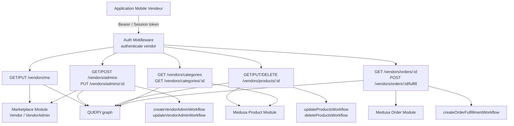
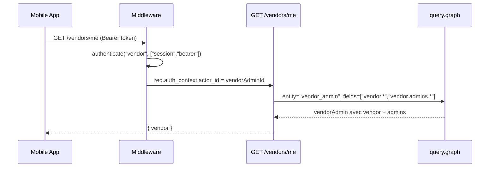
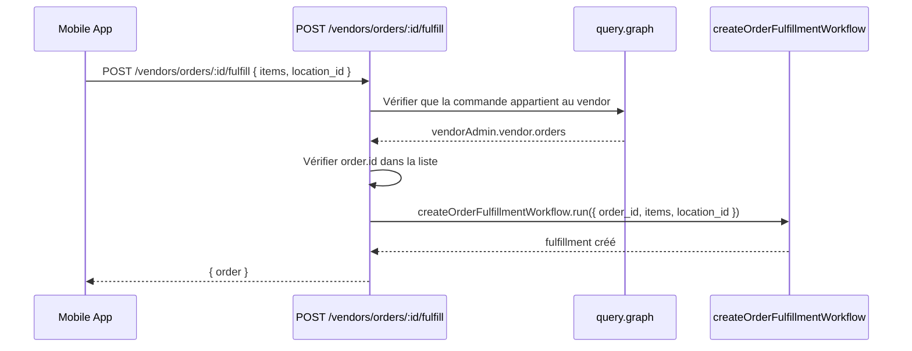

# Design Document: Vendor Mobile API

## Overview

Ce document décrit les APIs REST complètes pour l'application mobile vendeur sur le marketplace Medusa v2. Il couvre les endpoints manquants pour la gestion du profil vendor, des admins, des produits, des catégories et des commandes, en suivant les patterns établis dans le projet existant.

Le système s'appuie sur le module custom `marketplace` (modèles `Vendor` et `VendorAdmin`), le système d'auth `vendor` actor type, et les workflows natifs Medusa (`core-flows`) combinés à des workflows custom dans `src/workflows/marketplace/`.

## Architecture



## Séquences principales

### GET /vendors/me



### POST /vendors/orders/:id/fulfill



## Composants et Interfaces

### Routes à créer

#### GET /vendors/me
**Fichier**: `src/api/vendors/me/route.ts`

```typescript
interface VendorMeResponse {
  vendor: {
    id: string
    handle: string
    name: string
    logo: string | null
    admins: VendorAdmin[]
  }
}
```

#### PUT /vendors/me
**Fichier**: `src/api/vendors/me/route.ts`

```typescript
const PutVendorMeSchema = z.object({
  name: z.string().optional(),
  logo: z.string().optional(),
}).strict()
```

#### GET /vendors/admins
**Fichier**: `src/api/vendors/admins/route.ts`

```typescript
interface VendorAdminsResponse {
  admins: VendorAdmin[]
}
```

#### POST /vendors/admins
**Fichier**: `src/api/vendors/admins/route.ts`

```typescript
const PostVendorAdminSchema = z.object({
  email: z.string().email(),
  first_name: z.string().optional(),
  last_name: z.string().optional(),
  password: z.string(),
}).strict()
```

#### PUT /vendors/admins/:id
**Fichier**: `src/api/vendors/admins/[id]/route.ts` (étendre le fichier existant)

```typescript
const PutVendorAdminSchema = z.object({
  first_name: z.string().optional(),
  last_name: z.string().optional(),
}).strict()
```

#### GET /vendors/products/:id
**Fichier**: `src/api/vendors/products/[id]/route.ts`

#### PUT /vendors/products/:id
**Fichier**: `src/api/vendors/products/[id]/route.ts`

```typescript
// Réutiliser AdminUpdateProduct de @medusajs/medusa/api/admin/products/validators
```

#### DELETE /vendors/products/:id
**Fichier**: `src/api/vendors/products/[id]/route.ts`

#### GET /vendors/categories
**Fichier**: `src/api/vendors/categories/route.ts`

#### GET /vendors/categories/:id
**Fichier**: `src/api/vendors/categories/[id]/route.ts`

#### GET /vendors/orders/:id
**Fichier**: `src/api/vendors/orders/[id]/route.ts`

#### POST /vendors/orders/:id/fulfill
**Fichier**: `src/api/vendors/orders/[id]/fulfill/route.ts`

```typescript
const PostFulfillOrderSchema = z.object({
  location_id: z.string(),
  items: z.array(z.object({
    id: z.string(),
    quantity: z.number().int().positive(),
  })),
}).strict()
```

## Modèles de données

### VendorAdmin (existant)
```typescript
{
  id: string           // primaryKey
  first_name: string | null
  last_name: string | null
  email: string        // unique
  vendor_id: string    // FK → Vendor
}
```

### Vendor (existant)
```typescript
{
  id: string           // primaryKey
  handle: string       // unique
  name: string
  logo: string | null
  admins: VendorAdmin[]
}
```

## Workflows custom à créer

### update-vendor (`src/workflows/marketplace/update-vendor/`)

```typescript
type UpdateVendorWorkflowInput = {
  vendor_admin_id: string
  update: {
    name?: string
    logo?: string
  }
}
// Steps: useQueryGraphStep (récupérer vendor_id) → updateVendorStep
```

### create-vendor-admin (`src/workflows/marketplace/create-vendor-admin/`)

```typescript
type CreateVendorAdminWorkflowInput = {
  vendor_admin_id: string  // admin connecté (pour récupérer vendor_id)
  admin: {
    email: string
    first_name?: string
    last_name?: string
  }
  authIdentityId: string
}
// Steps: useQueryGraphStep → createVendorAdminStep → setAuthAppMetadataStep
```

### update-vendor-admin (`src/workflows/marketplace/update-vendor-admin/`)

```typescript
type UpdateVendorAdminWorkflowInput = {
  id: string
  update: {
    first_name?: string
    last_name?: string
  }
}
// Steps: updateVendorAdminStep
```

## Middlewares à ajouter dans `src/api/middlewares.ts`

```typescript
// Profil vendor
{ matcher: "/vendors/me", method: ["GET", "PUT"], middlewares: [authenticate("vendor", ["session", "bearer"])] },
{ matcher: "/vendors/me", method: ["PUT"], middlewares: [validateAndTransformBody(PutVendorMeSchema)] },

// Admins
{ matcher: "/vendors/admins", method: ["GET"], middlewares: [authenticate("vendor", ["session", "bearer"])] },
{ matcher: "/vendors/admins", method: ["POST"], middlewares: [authenticate("vendor", ["session", "bearer"]), validateAndTransformBody(PostVendorAdminSchema)] },
{ matcher: "/vendors/admins/:id", method: ["PUT"], middlewares: [authenticate("vendor", ["session", "bearer"]), validateAndTransformBody(PutVendorAdminSchema)] },

// Produits
{ matcher: "/vendors/products/:id", method: ["GET", "PUT", "DELETE"], middlewares: [authenticate("vendor", ["session", "bearer"])] },
{ matcher: "/vendors/products/:id", method: ["PUT"], middlewares: [validateAndTransformBody(AdminUpdateProduct)] },

// Catégories
{ matcher: "/vendors/categories", method: ["GET"], middlewares: [authenticate("vendor", ["session", "bearer"])] },
{ matcher: "/vendors/categories/:id", method: ["GET"], middlewares: [authenticate("vendor", ["session", "bearer"])] },

// Commandes
{ matcher: "/vendors/orders/:id", method: ["GET"], middlewares: [authenticate("vendor", ["session", "bearer"])] },
{ matcher: "/vendors/orders/:id/fulfill", method: ["POST"], middlewares: [authenticate("vendor", ["session", "bearer"]), validateAndTransformBody(PostFulfillOrderSchema)] },
```

> Note: Le matcher `/vendors/*` existant couvre déjà l'authentification pour tous les sous-chemins. Les entrées ci-dessus servent principalement à ajouter la validation du body (`validateAndTransformBody`) sur les routes POST/PUT.

## Gestion des erreurs

### Accès non autorisé à une ressource d'un autre vendor

**Condition**: Un vendor tente d'accéder à un produit/commande/admin qui ne lui appartient pas.
**Réponse**: `MedusaError(MedusaError.Types.NOT_FOUND, "...")` — on retourne 404 plutôt que 403 pour ne pas révéler l'existence de la ressource.
**Pattern**:
```typescript
const vendorOrders = vendorAdmin.vendor.orders?.map(o => o.id) ?? []
if (!vendorOrders.includes(req.params.id)) {
  throw new MedusaError(MedusaError.Types.NOT_FOUND, "Order not found")
}
```

### Admin non trouvé dans le vendor

**Condition**: PUT/DELETE sur un admin qui n'appartient pas au vendor connecté.
**Réponse**: `MedusaError(MedusaError.Types.NOT_FOUND, "Vendor admin not found")`

### Fulfillment sur commande non-vendor

**Condition**: POST /vendors/orders/:id/fulfill sur une commande qui n'appartient pas au vendor.
**Réponse**: `MedusaError(MedusaError.Types.NOT_FOUND, "Order not found")`

## Stratégie de tests

### Tests unitaires

- Chaque workflow custom (update-vendor, create-vendor-admin, update-vendor-admin) doit avoir ses steps testés isolément.
- Vérifier les compensations (rollback) des steps.

### Tests de propriétés (Property-Based Testing)

**Librairie**: `fast-check`

- `∀ update ∈ PutVendorMeSchema` → le vendor retourné par GET /vendors/me reflète les changements
- `∀ admin ∈ PostVendorAdminSchema` → l'admin créé appartient bien au vendor de l'admin connecté
- `∀ product_id` non lié au vendor → GET/PUT/DELETE retourne 404

### Tests d'intégration

- Flux complet: créer vendor → créer produit → créer commande → fulfillment
- Vérifier l'isolation entre vendors (vendor A ne voit pas les ressources de vendor B)

## Considérations de sécurité

- Toutes les routes utilisent `authenticate("vendor", ["session", "bearer"])` — pas d'accès anonyme.
- Vérification systématique que la ressource demandée (produit, commande, admin) appartient bien au vendor de l'admin connecté via `query.graph` avant toute opération.
- Les catégories sont en lecture seule pour les vendors (pas de création/modification).
- Le fulfillment utilise le workflow natif `createOrderFulfillmentWorkflow` qui gère les validations métier Medusa.

## Dépendances

- `@medusajs/framework/http` — `AuthenticatedMedusaRequest`, `MedusaResponse`
- `@medusajs/framework/utils` — `ContainerRegistrationKeys`, `MedusaError`, `Modules`
- `@medusajs/framework/zod` — validation des bodies
- `@medusajs/medusa/core-flows` — `updateProductsWorkflow`, `deleteProductsWorkflow`, `createOrderFulfillmentWorkflow`, `useQueryGraphStep`, `setAuthAppMetadataStep`
- `@medusajs/medusa/api/admin/products/validators` — `AdminUpdateProduct`
- Module custom `marketplace` — `MARKETPLACE_MODULE`, `MarketplaceModuleService`
